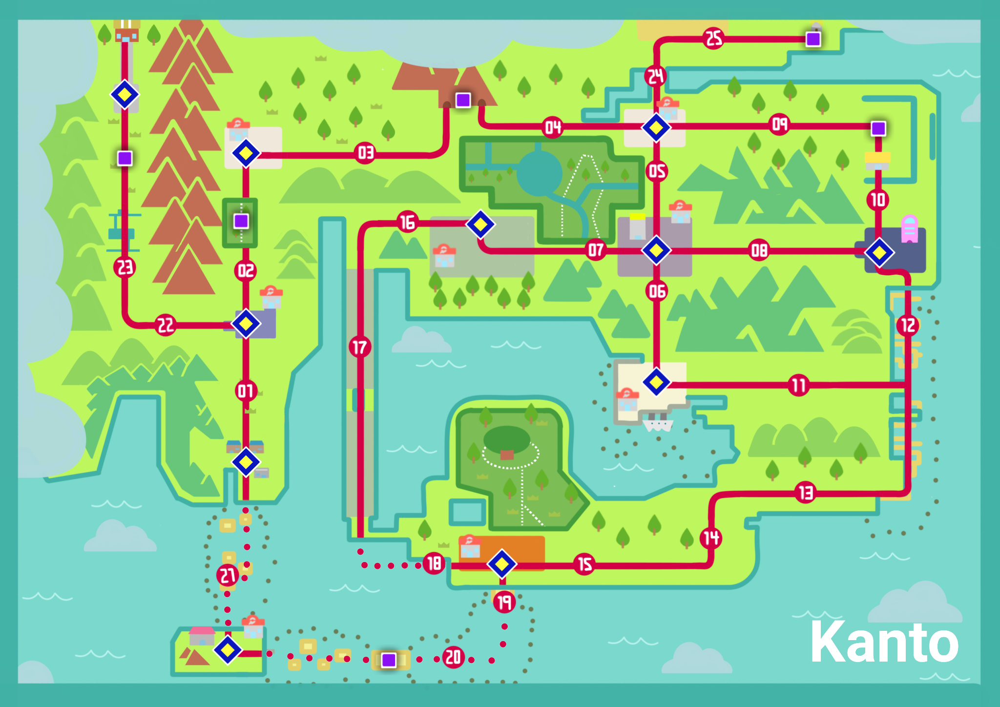

<h1>About Kanto Region</h1>

The <b>Kanto region</b> (Japanese: カントー地方 Kanto region) is a region of the Pokémon world. Kanto is located east of Johto, which together form a joint landmass that is south of Sinnoh.

Kanto is the setting of the first generation of games and can be explored in generations II, III, IV, and VII.

Professor Oak is the resident Pokémon Professor and gives Pokémon Trainers a choice between Bulbasaur, Charmander, or Squirtle as their starter Pokémon. In Pokémon Yellow, the only choice is a Pikachu that he recently caught, although he did have an Eevee. In Let's Go, Pikachu!, the player chooses Pikachu. In Let's Go, Eevee!, the player chooses Eevee. In the games, the player begins their journey in Pallet Town and ends it at Indigo Plateau.
